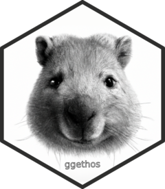

<!-- README.md is generated from README.Rmd. Please edit that file -->

```{r, include = FALSE}
knitr::opts_chunk$set(
  collapse = TRUE,
  comment = "#>",
  fig.path = "man/figures/README-",
  out.width = "100%"
)
```

```{r setup, include = FALSE}
library(ggplot2)
if (requireNamespace("devtools", quietly = TRUE)) {
  devtools::load_all()
} else {
  library(ggethos)
}
```

# ggethos <a href="https://matiasandina.github.io/ggethos/"></a>

<!-- badges: start -->
[](https://CRAN.R-project.org/package=ggethos)
[](https://lifecycle.r-lib.org/articles/stages.html#experimental)
<!-- badges: end -->

The goal of `ggethos` is to provide a user-frienldy way to plot ethograms using `ggplot2`.

## Installation

At this point, this is an experimental package, and you can only install the development version from [GitHub](https://github.com/) with:

``` r
# install.packages("devtools")
devtools::install_github("matiasandina/ggethos")
```

Once it's on CRAN, you can install the released version of ggethos from [CRAN](https://CRAN.R-project.org) with:

``` r
install.packages("ggethos")
```

And the development version from [GitHub](https://github.com/) with:

``` r
# install.packages("devtools")
devtools::install_github("matiasandina/ggethos")
```
## Example

There are two supported workflows:

1. `geom_ethogram()` computes ethogram segments for you (quick start).
2. `compute_*()` lets you precompute segments for explicit control and further analysis (recommended for advanced user and complex cases).

### Quick start (stat computes)

`ethogram_demo` is a small deterministic dataset designed to make outputs easy
to verify.

```{r example-demo, message=FALSE, warning=FALSE}
ggplot(ethogram_demo,
       aes(x = seconds, y = subject, behaviour = behaviour, colour = behaviour)) +
  geom_ethogram() +
  facet_wrap(~ trial, labeller = label_both)
```

### Precompute segments (pipeline)

When you precompute segments, `geom_ethogram(stat = "identity")` will draw them
without recomputing. The computed data keeps the original column names and adds
`*_end` columns plus mapping metadata.

```{r example-pipeline-table, message=FALSE, warning=FALSE}
seg <- compute_samples(ethogram_demo,
                       x = seconds,
                       y = subject,
                       behaviour = behaviour,
                       interval = 5)

print(seg, n=Inf)
```

```{r example-pipeline-plot, message=FALSE, warning=FALSE}
ggplot() +
  geom_ethogram(data = seg, aes(colour = behaviour), stat = "identity")
```


### Realistic dataset (wombats)

`wombats` is a larger, more variable dataset with multiple trials and misalignment on acquisition dates.

You can see here that trials were recorded at different times for different wombats.

```{r example-wombats, warning=FALSE, message=FALSE}
ggplot(wombats, 
       aes(x = seconds, y = wombat, behaviour = behaviour, color = behaviour)) +
  geom_ethogram() +
  facet_wrap(~ trial, labeller = label_both)
```

In this example, we are aligning trials so that each trial starts at `t0=0`.

```{r example-wombats-align, warning=FALSE, message=FALSE}
ggplot(wombats, 
       aes(x = seconds, y = wombat, behaviour = behaviour, color = behaviour)) +
  geom_ethogram(align_trials = TRUE) +
  facet_wrap(~ trial, labeller = label_both)
```


## Issues

This is a preliminary release and the package is still very much experimental. Please [file issues](https://github.com/matiasandina/ggethos/issues) to improve it. 
