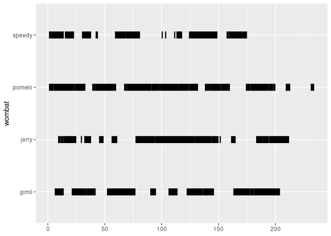

<!-- README.md is generated from README.Rmd. Please edit that file -->

# ggethos <a href="https://matiasandina.github.io/ggethos/"></a>

<!-- badges: start -->

[](https://CRAN.R-project.org/package=ggethos)
[](https://lifecycle.r-lib.org/articles/stages.html#experimental)
<!-- badges: end -->

The goal of `ggethos` is to provide a user-frienldy way to plot
ethograms using `ggplot2`.

## Installation

At this point, this is an experimental package, and you can only install
the development version from [GitHub](https://github.com/) with:

``` r
# install.packages("devtools")
devtools::install_github("matiasandina/ggethos")
```

Once it’s on CRAN, you can install the released version of ggethos from
[CRAN](https://CRAN.R-project.org) with:

``` r
install.packages("ggethos")
```

And the development version from [GitHub](https://github.com/) with:

``` r
# install.packages("devtools")
devtools::install_github("matiasandina/ggethos")
```

## Example

This is a basic example of plotting ethograms with `ggethos`:

``` r
library(ggplot2)
library(ggethos)
library(dplyr)
wombats %>% 
  group_by(wombat) %>% 
  slice(1:2)
#> # A tibble: 8 × 9
#> # Groups:   wombat [4]
#>   wombat trial behaviour trial_frame frame seconds exp_dt             
#>   <chr>  <int> <chr>           <int> <int>   <dbl> <dttm>             
#> 1 gimli      1 <NA>                1     1       0 2019-08-28 06:37:44
#> 2 gimli      1 <NA>                2     2       5 2019-08-28 06:37:44
#> 3 jerry      1 <NA>                1     1       0 2020-09-21 22:16:33
#> 4 jerry      1 <NA>                2     2       5 2020-09-21 22:16:33
#> 5 pomelo     1 digging             1     1       0 2019-09-20 23:57:04
#> 6 pomelo     1 digging             2     2       5 2019-09-20 23:57:04
#> 7 speedy     1 pondering           1     1       0 2020-01-14 08:37:44
#> 8 speedy     1 pondering           2     2       5 2020-01-14 08:37:44
#> # … with 2 more variables: start_dt <dttm>, end_dt <dttm>
```

Let’s plot the behavior of the wombats

``` r
# x axis will be in sample space
ggplot(wombats, aes(y=wombat, behaviour=behaviour)) + geom_ethogram() 
```



Let’s look at them using a proper x axis and separating by trials:

``` r
# x axis will be in seconds
ggplot(wombats, aes(x=seconds, 
                    y=wombat, 
                    behaviour=behaviour,
                    color=behaviour)) + 
  geom_ethogram() +
  facet_wrap(~trial)
```


Can we align the trials? Yes! Use `align_trials = TRUE`:

``` r
# x axis will be in seconds
# trials re-aligned
ggplot(wombats, aes(x=seconds, 
                    y=wombat, 
                    behaviour=behaviour,
                    color=behaviour)) + 
  geom_ethogram(align_trials = T) +
  facet_wrap(~trial)
```


## Issues

This is a preliminary release and the package is still very much
experimental. Please [file
issues](https://github.com/matiasandina/ggethos/issues) to improve it.
