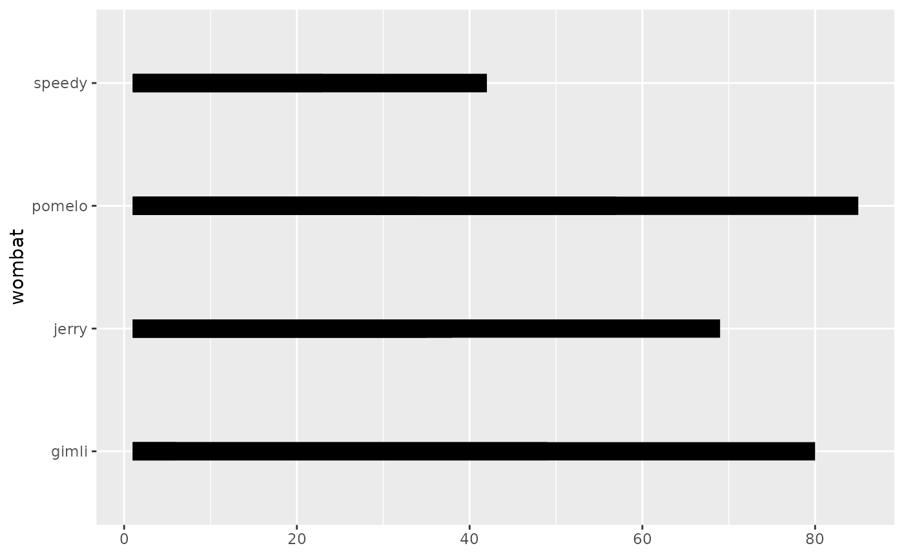
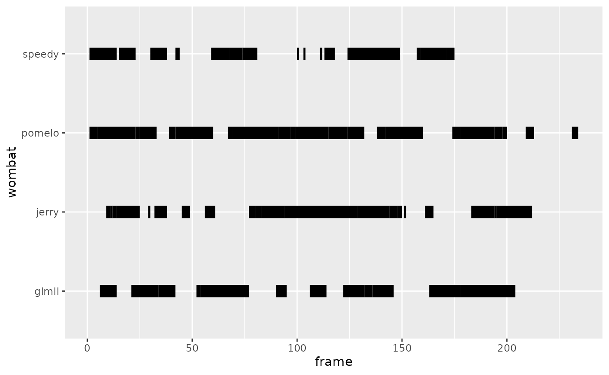
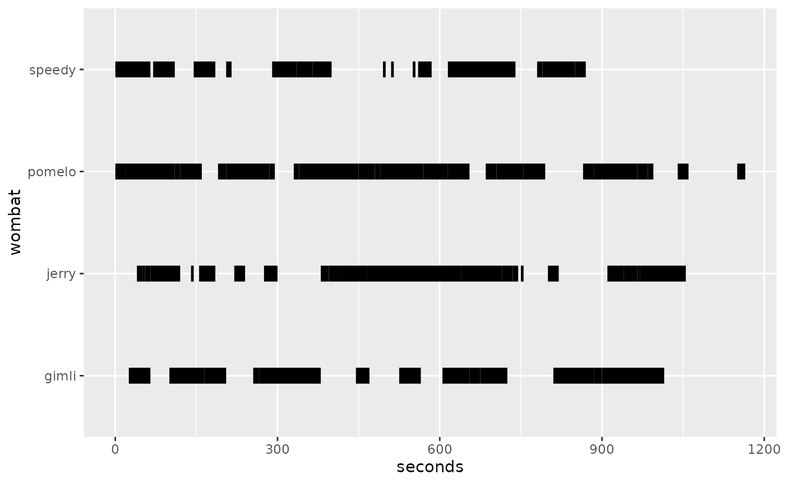
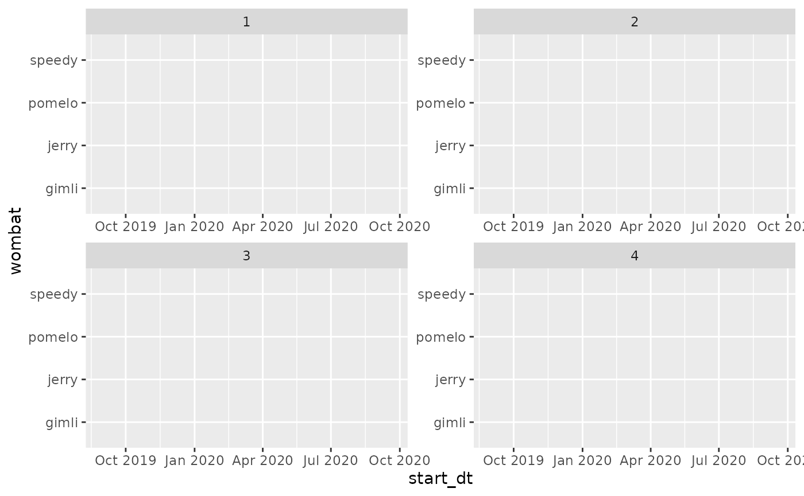
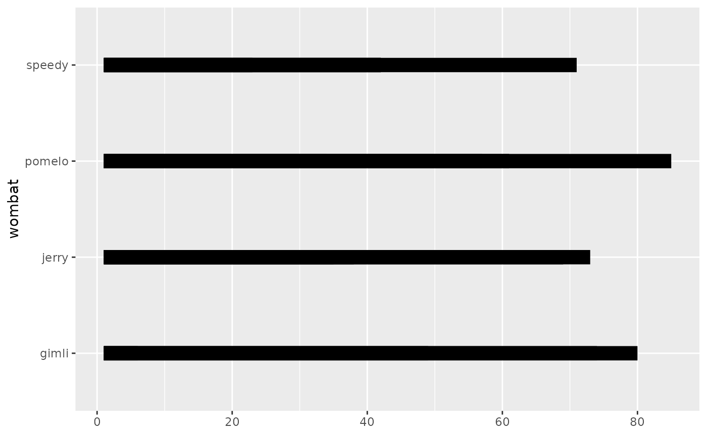
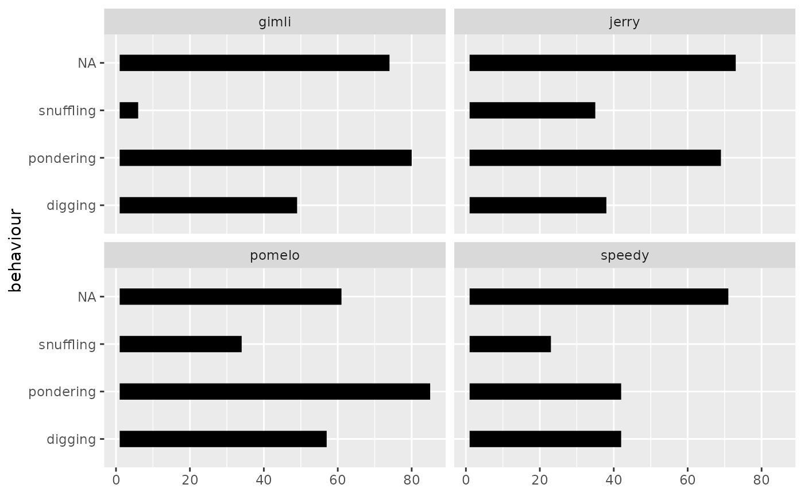
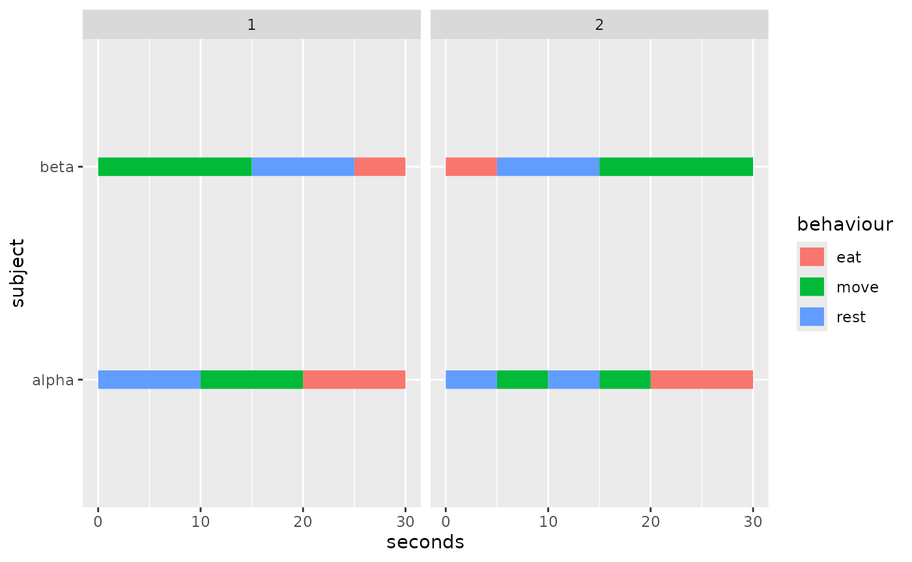

# Basic Examples

``` r
library(ggplot2)
library(ggethos)
```

## Ethogram Basics and heuristics

To plot an ethogram, we need to know:

1.  `x` and `xend`
2.  `y` axis
3.  What observations must be grouped together
4.  How to color the segments (Optional)

However, at its bare minimum, users could potentially get away with
just:

1.  `y` axis
2.  What observations must be grouped together

The philosophy behind
[`geom_ethogram()`](https://matiasandina.github.io/ggethos/reference/geom_ethogram.md)
is to facilitate the user experience. In most use cases, observations
will be ordered according to the way they were temporally collected.
Thus, it is reasonable for
[`geom_ethogram()`](https://matiasandina.github.io/ggethos/reference/geom_ethogram.md)
to assume `y` observations are ordered in time and to use the implied
order to calculate `x` and `xend` using certain heuristics.

Because we want to be transparent about guessing the temporal structure,
we provide verbose output when `x` and/or `xend` are missing.

Ethograms can easily contain data aggregated from thousands of
observations (e.g., videos at 30fps). But guessing the interval forces
us to plot . To prevent unnecessary plotting,
[`geom_ethogram()`](https://matiasandina.github.io/ggethos/reference/geom_ethogram.md)
aggregates continuous behaviors (i.e., instead of plotting 3 blocks of
length 1, we plot 1 block of length 3). This function is implemented by
the `behaviour` aesthetic, which allows us to free typical `ggplot2`
aesthethics such as `group` and `coluor` for other uses.

Finally,
[`geom_ethogram()`](https://matiasandina.github.io/ggethos/reference/geom_ethogram.md)
will remove `NA`s in your data by default. You can change this by
setting `remove_na=FALSE` (see [NA handling](#na-handling)).

## Basic Examples x Axis

This article contains information about how
[`geom_ethogram()`](https://matiasandina.github.io/ggethos/reference/geom_ethogram.md)
handles the `x` axis computation with different
[`aes()`](https://ggplot2.tidyverse.org/reference/aes.html) calls and
data types. For other examples, see [Using
Color](https://matiasandina.github.io/ggethos/articles/articles/color.md).

### Using implied order

Frames are provided in implied order and
[`geom_ethogram()`](https://matiasandina.github.io/ggethos/reference/geom_ethogram.md)
will guess interval of 1. The `x` axis will be in “sample space” (i.e.,
1:n_samples).

``` r
# Frames in implied order
ggplot(wombats, aes(y = wombat, 
                    behaviour = behaviour)) +
  geom_ethogram() 
```



The case above is the same as providing a `frame = 1:n()` column (named
after a putative video frame ID). The `wombats` dataset already contains
such a column.

``` r
# Frames of uniform duration 1
ggplot(wombats, aes(x = frame, 
                    y = wombat, behaviour = behaviour)) +
  geom_ethogram() 
#> ℹ No observation interval provided, using guessed interval 1.
```



If the sampling period is known (e.g., 5 seconds), it’s easy to go from
`frame` (e.g., 1, 2, 3) to `seconds` (e.g., 5, 10, 15 seconds).

``` r
# Observations at uniform intervals
ggplot(wombats, 
       aes(x = seconds, 
           y = wombat, 
           behaviour = behaviour)) +
  geom_ethogram()
#> ℹ No observation interval provided, using guessed interval 5.
```



### Handling Datetimes

``` r
# Observations at specified datetimes with uniform 5-second intervals
ggplot(wombats_duration, aes(x = start_dt, y = wombat, behaviour = behaviour)) +
  geom_ethogram() +
  facet_wrap(~ trial, scales = "free")
#> ℹ No observation interval provided, using guessed interval 1.
#> ℹ No observation interval provided, using guessed interval 2.
#> ℹ No observation interval provided, using guessed interval 2.
#> ℹ No observation interval provided, using guessed interval 1.
```



### NA handling

This will produce a plot that looks strange compared with the other
ones. It’s just that the NAs are also shown. If your data is complete,
the plots in these examples will look similar to the plot show below and
you might want to look into using color.

``` r
# Frames in implied order
ggplot(wombats, aes(y = wombat, 
                    behaviour = behaviour)) +
  geom_ethogram(remove_nas = FALSE) 
```



### Ethogram becomes barplot

While using this package, it’s possible to avoid providing enough
information for us to compute a proper ethogram. For example, we can
accidentaly transform an ethogram into a bar plot.

``` r
ggplot(wombats, 
        aes(y = behaviour, 
            behaviour = behaviour, 
            group=behaviour)) +
     geom_ethogram(remove_nas = F) + 
  facet_wrap(~wombat)
```



## Summary

This article covered the basics of how
[`geom_ethogram()`](https://matiasandina.github.io/ggethos/reference/geom_ethogram.md)
handles the `x` axis and the overall philosophy behind this function.

## Demo dataset for visual checks

`ethogram_demo` is a small deterministic dataset designed to make plots
easy to reason about. Each subject has two trials with short, repeated
behaviour runs.

``` r
ggplot(ethogram_demo,
       aes(x = seconds, y = subject, behaviour = behaviour, colour = behaviour)) +
  geom_ethogram() +
  facet_wrap(~ trial)
#> ℹ No observation interval provided, using guessed interval 5.
#> ℹ No observation interval provided, using guessed interval 5.
```



## Session Info

``` r
sessioninfo::session_info()
#> ─ Session info ───────────────────────────────────────────────────────────────
#>  setting  value
#>  version  R version 4.5.2 (2025-10-31)
#>  os       Ubuntu 24.04.3 LTS
#>  system   x86_64, linux-gnu
#>  ui       X11
#>  language en
#>  collate  C.UTF-8
#>  ctype    C.UTF-8
#>  tz       UTC
#>  date     2026-01-29
#>  pandoc   3.1.11 @ /opt/hostedtoolcache/pandoc/3.1.11/x64/ (via rmarkdown)
#>  quarto   NA
#> 
#> ─ Packages ───────────────────────────────────────────────────────────────────
#>  package      * version date (UTC) lib source
#>  bslib          0.10.0  2026-01-26 [1] RSPM
#>  cachem         1.1.0   2024-05-16 [1] RSPM
#>  cli            3.6.5   2025-04-23 [1] RSPM
#>  desc           1.4.3   2023-12-10 [1] RSPM
#>  digest         0.6.39  2025-11-19 [1] RSPM
#>  dplyr          1.1.4   2023-11-17 [1] RSPM
#>  evaluate       1.0.5   2025-08-27 [1] RSPM
#>  farver         2.1.2   2024-05-13 [1] RSPM
#>  fastmap        1.2.0   2024-05-15 [1] RSPM
#>  fs             1.6.6   2025-04-12 [1] RSPM
#>  generics       0.1.4   2025-05-09 [1] RSPM
#>  ggethos      * 0.0.1   2026-01-29 [1] local
#>  ggplot2      * 4.0.1   2025-11-14 [1] RSPM
#>  glue           1.8.0   2024-09-30 [1] RSPM
#>  gtable         0.3.6   2024-10-25 [1] RSPM
#>  htmltools      0.5.9   2025-12-04 [1] RSPM
#>  jquerylib      0.1.4   2021-04-26 [1] RSPM
#>  jsonlite       2.0.0   2025-03-27 [1] RSPM
#>  knitr          1.51    2025-12-20 [1] RSPM
#>  labeling       0.4.3   2023-08-29 [1] RSPM
#>  lifecycle      1.0.5   2026-01-08 [1] RSPM
#>  magrittr       2.0.4   2025-09-12 [1] RSPM
#>  pillar         1.11.1  2025-09-17 [1] RSPM
#>  pkgconfig      2.0.3   2019-09-22 [1] RSPM
#>  pkgdown        2.2.0   2025-11-06 [1] any (@2.2.0)
#>  R6             2.6.1   2025-02-15 [1] RSPM
#>  ragg           1.5.0   2025-09-02 [1] RSPM
#>  RColorBrewer   1.1-3   2022-04-03 [1] RSPM
#>  rlang          1.1.7   2026-01-09 [1] RSPM
#>  rmarkdown      2.30    2025-09-28 [1] RSPM
#>  S7             0.2.1   2025-11-14 [1] RSPM
#>  sass           0.4.10  2025-04-11 [1] RSPM
#>  scales         1.4.0   2025-04-24 [1] RSPM
#>  sessioninfo    1.2.3   2025-02-05 [1] any (@1.2.3)
#>  systemfonts    1.3.1   2025-10-01 [1] RSPM
#>  textshaping    1.0.4   2025-10-10 [1] RSPM
#>  tibble         3.3.1   2026-01-11 [1] RSPM
#>  tidyselect     1.2.1   2024-03-11 [1] RSPM
#>  vctrs          0.7.1   2026-01-23 [1] RSPM
#>  withr          3.0.2   2024-10-28 [1] RSPM
#>  xfun           0.56    2026-01-18 [1] RSPM
#>  yaml           2.3.12  2025-12-10 [1] RSPM
#> 
#>  [1] /home/runner/work/_temp/Library
#>  [2] /opt/R/4.5.2/lib/R/site-library
#>  [3] /opt/R/4.5.2/lib/R/library
#>  * ── Packages attached to the search path.
#> 
#> ──────────────────────────────────────────────────────────────────────────────
```
