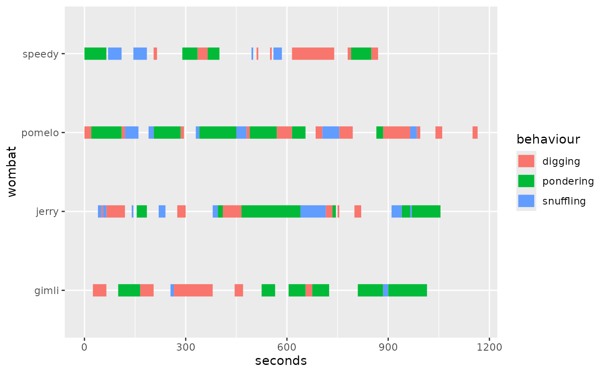
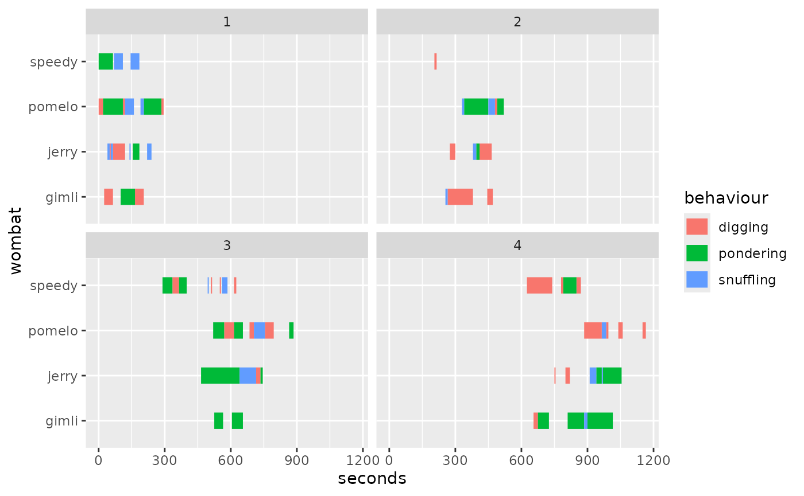
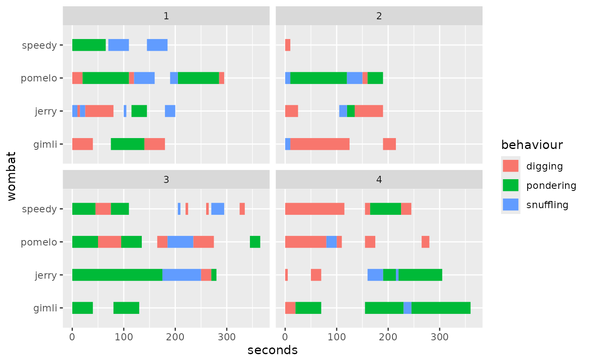
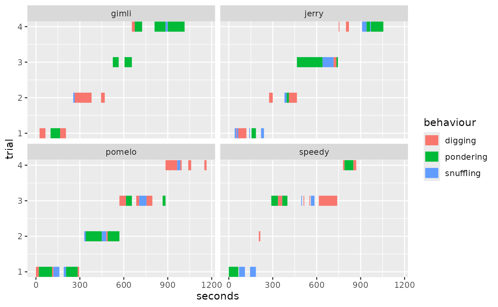
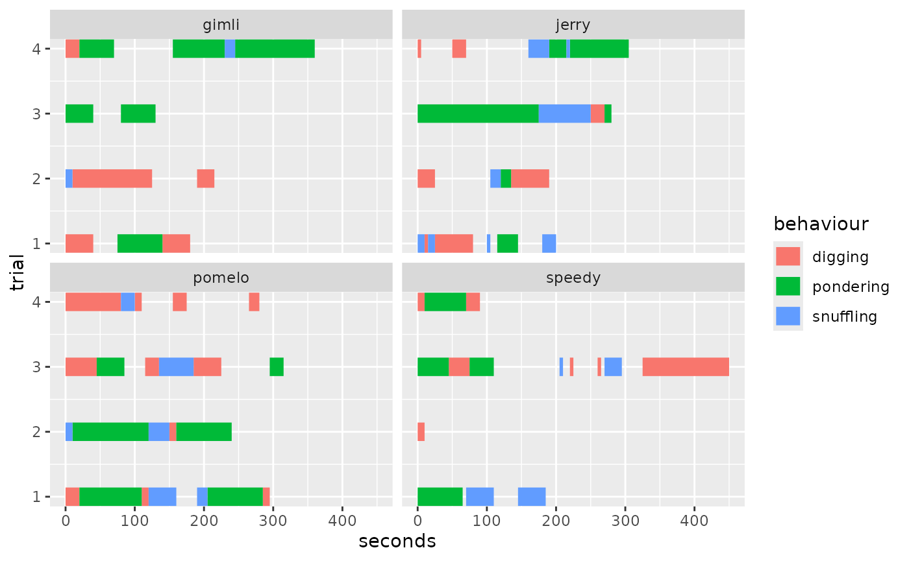

# Using Trials

``` r
library(ggethos)
library(ggplot2)
```

In many situations, behaviour is collected in trials. For this reason,
we have provided `trials` in `wombats` and the `align_trials` parameter
in
[`geom_ethogram()`](https://matiasandina.github.io/ggethos/reference/geom_ethogram.md).

## Understanding Trials

Let’s explore the nature of the dataset. This is how it looks like when
not visualizing trials.

``` r
ggplot(wombats, 
       aes(x=seconds, 
           y = wombat, 
           behaviour = behaviour,
           color=behaviour)) +
  geom_ethogram() 
#> ℹ No observation interval provided, using guessed interval 5.
```



Here’s when we facet by trial:

``` r
ggplot(wombats, 
       aes(x=seconds, 
           y = wombat, 
           behaviour = behaviour,
           color = behaviour)) +
  geom_ethogram() +
  facet_wrap(~trial)
#> ℹ No observation interval provided, using guessed interval 5.
#> ℹ No observation interval provided, using guessed interval 5.
#> ℹ No observation interval provided, using guessed interval 5.
#> ℹ No observation interval provided, using guessed interval 5.
```



We can now see the issue: the trials were collected with a continuous
clock and we would like to align them to common time (i.e., have all
trials start at zero). This is when `align_trials` comes handy:

``` r
ggplot(wombats, 
       aes(x=seconds, 
           y = wombat, 
           behaviour = behaviour,
           color = behaviour)) +
  geom_ethogram(align_trials=TRUE) +
  facet_wrap(~trial)
#> ℹ No observation interval provided, using guessed interval 5.
#> ℹ No observation interval provided, using guessed interval 5.
#> ℹ No observation interval provided, using guessed interval 5.
#> ℹ No observation interval provided, using guessed interval 5.
```



Here’s an another example. Let’s say we wanted to facet by `wombat` and
have `trial` be on the `y` axis instead.

``` r
ggplot(wombats, 
       aes(x=seconds, 
           y = trial, 
           behaviour = behaviour,
           color = behaviour)) +
    geom_ethogram() +
    facet_wrap(~wombat)
#> ℹ No observation interval provided, using guessed interval 5.
#> ℹ No observation interval provided, using guessed interval 5.
#> ℹ No observation interval provided, using guessed interval 5.
#> ℹ No observation interval provided, using guessed interval 5.
```

 We can easily align trials
again using `align_trials=T`:

``` r
ggplot(wombats, 
       aes(x=seconds, 
           y = trial, 
           behaviour = behaviour,
           color = behaviour)) +
    geom_ethogram(align_trials = T) +
    facet_wrap(~wombat)
#> ℹ No observation interval provided, using guessed interval 5.
#> ℹ No observation interval provided, using guessed interval 5.
#> ℹ No observation interval provided, using guessed interval 5.
#> ℹ No observation interval provided, using guessed interval 5.
```



## Summary

In this article, we have covered basic functionality of aligning trials
by using the `align_trials` argument.

## Session Info

``` r
sessioninfo::session_info()
#> ─ Session info ───────────────────────────────────────────────────────────────
#>  setting  value
#>  version  R version 4.5.2 (2025-10-31)
#>  os       Ubuntu 24.04.3 LTS
#>  system   x86_64, linux-gnu
#>  ui       X11
#>  language en
#>  collate  C.UTF-8
#>  ctype    C.UTF-8
#>  tz       UTC
#>  date     2026-01-29
#>  pandoc   3.1.11 @ /opt/hostedtoolcache/pandoc/3.1.11/x64/ (via rmarkdown)
#>  quarto   NA
#> 
#> ─ Packages ───────────────────────────────────────────────────────────────────
#>  package      * version date (UTC) lib source
#>  assertthat     0.2.1   2019-03-21 [1] RSPM
#>  bslib          0.10.0  2026-01-26 [1] RSPM
#>  cachem         1.1.0   2024-05-16 [1] RSPM
#>  cli            3.6.5   2025-04-23 [1] RSPM
#>  desc           1.4.3   2023-12-10 [1] RSPM
#>  digest         0.6.39  2025-11-19 [1] RSPM
#>  dplyr          1.1.4   2023-11-17 [1] RSPM
#>  evaluate       1.0.5   2025-08-27 [1] RSPM
#>  farver         2.1.2   2024-05-13 [1] RSPM
#>  fastmap        1.2.0   2024-05-15 [1] RSPM
#>  fs             1.6.6   2025-04-12 [1] RSPM
#>  generics       0.1.4   2025-05-09 [1] RSPM
#>  ggethos      * 0.0.1   2026-01-29 [1] local
#>  ggplot2      * 4.0.1   2025-11-14 [1] RSPM
#>  glue           1.8.0   2024-09-30 [1] RSPM
#>  gtable         0.3.6   2024-10-25 [1] RSPM
#>  htmltools      0.5.9   2025-12-04 [1] RSPM
#>  jquerylib      0.1.4   2021-04-26 [1] RSPM
#>  jsonlite       2.0.0   2025-03-27 [1] RSPM
#>  knitr          1.51    2025-12-20 [1] RSPM
#>  labeling       0.4.3   2023-08-29 [1] RSPM
#>  lifecycle      1.0.5   2026-01-08 [1] RSPM
#>  magrittr       2.0.4   2025-09-12 [1] RSPM
#>  pillar         1.11.1  2025-09-17 [1] RSPM
#>  pkgconfig      2.0.3   2019-09-22 [1] RSPM
#>  pkgdown        2.2.0   2025-11-06 [1] any (@2.2.0)
#>  R6             2.6.1   2025-02-15 [1] RSPM
#>  ragg           1.5.0   2025-09-02 [1] RSPM
#>  RColorBrewer   1.1-3   2022-04-03 [1] RSPM
#>  rlang          1.1.7   2026-01-09 [1] RSPM
#>  rmarkdown      2.30    2025-09-28 [1] RSPM
#>  S7             0.2.1   2025-11-14 [1] RSPM
#>  sass           0.4.10  2025-04-11 [1] RSPM
#>  scales         1.4.0   2025-04-24 [1] RSPM
#>  sessioninfo    1.2.3   2025-02-05 [1] any (@1.2.3)
#>  systemfonts    1.3.1   2025-10-01 [1] RSPM
#>  textshaping    1.0.4   2025-10-10 [1] RSPM
#>  tibble         3.3.1   2026-01-11 [1] RSPM
#>  tidyselect     1.2.1   2024-03-11 [1] RSPM
#>  vctrs          0.7.1   2026-01-23 [1] RSPM
#>  withr          3.0.2   2024-10-28 [1] RSPM
#>  xfun           0.56    2026-01-18 [1] RSPM
#>  yaml           2.3.12  2025-12-10 [1] RSPM
#> 
#>  [1] /home/runner/work/_temp/Library
#>  [2] /opt/R/4.5.2/lib/R/site-library
#>  [3] /opt/R/4.5.2/lib/R/library
#>  * ── Packages attached to the search path.
#> 
#> ──────────────────────────────────────────────────────────────────────────────
```
