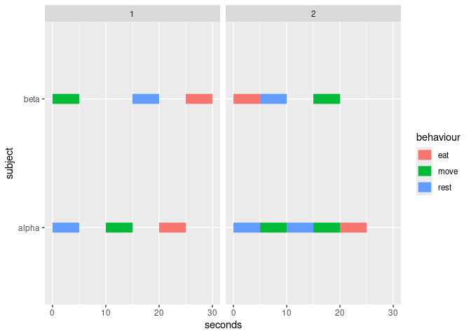
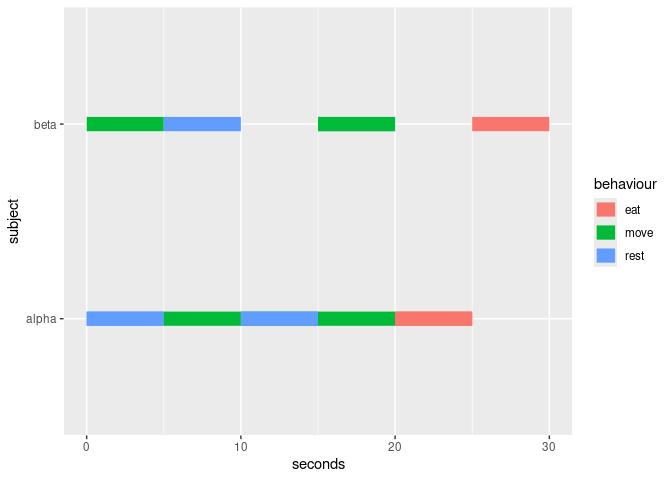
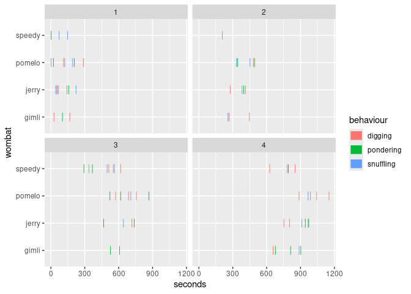
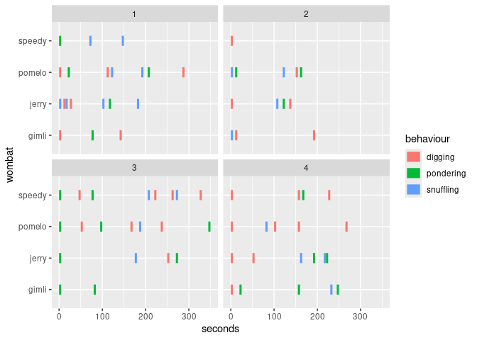

# ggethos

The goal of `ggethos` is to provide a user-frienldy way to plot
ethograms using `ggplot2`.

## Installation

At this point, this is an experimental package, and you can only install
the development version from [GitHub](https://github.com/) with:

``` r
# install.packages("devtools")
devtools::install_github("matiasandina/ggethos")
```

Once it’s on CRAN, you can install the released version of ggethos from
[CRAN](https://CRAN.R-project.org) with:

``` r
install.packages("ggethos")
```

And the development version from [GitHub](https://github.com/) with:

``` r
# install.packages("devtools")
devtools::install_github("matiasandina/ggethos")
```

## Example

There are two supported workflows:

1.  [`geom_ethogram()`](https://matiasandina.github.io/ggethos/reference/geom_ethogram.md)
    computes ethogram segments for you (quick start).
2.  `compute_*()` lets you precompute segments for debugging or further
    analysis.

### Quick start (stat computes)

`ethogram_demo` is a small deterministic dataset designed to make
outputs easy to verify.

``` r
ggplot(ethogram_demo,
       aes(x = seconds, y = subject, behaviour = behaviour, colour = behaviour)) +
  geom_ethogram() +
  facet_wrap(~ trial)
```



### Precompute segments (pipeline)

When you precompute segments, `geom_ethogram(stat = "identity")` will
draw them without recomputing. The computed data keeps the original
column names and adds `*_end` columns plus mapping metadata.

``` r
seg <- compute_samples(ethogram_demo,
                       x = seconds,
                       y = subject,
                       behaviour = behaviour,
                       interval = 5)

ggplot() +
  geom_ethogram(data = seg, aes(colour = behaviour), stat = "identity")
```



### Realistic dataset (wombats)

`wombats` is a larger, more variable dataset with multiple trials.

``` r
ggplot(wombats, aes(x = seconds, y = wombat, behaviour = behaviour, color = behaviour)) +
  geom_ethogram() +
  facet_wrap(~ trial)
```



``` r
ggplot(wombats, aes(x = seconds, y = wombat, behaviour = behaviour, color = behaviour)) +
  geom_ethogram(align_trials = TRUE) +
  facet_wrap(~ trial)
```



## Issues

This is a preliminary release and the package is still very much
experimental. Please [file
issues](https://github.com/matiasandina/ggethos/issues) to improve it.
